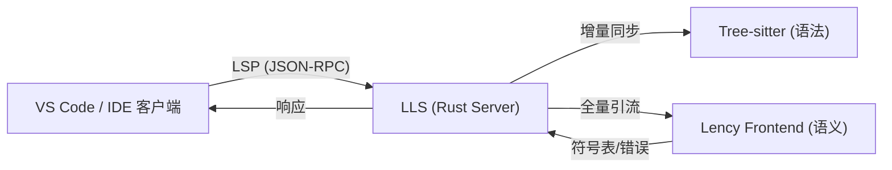

# Lency IDE 技术架构与支撑演进路线图

本手册详细定义了 Lency 语言开发工具链的长期技术演进方向，重点在于从目前的正则表达式模拟逻辑转向基于编译器后端的深度语义支撑架构。

---

## 1. 核心架构演进：Lency Language Server (LLS)

目前的扩展采用 VS Code 客户端 RegEx 匹配。下一阶段的核心是将逻辑下沉至使用 Rust 编写的统一语言服务器 (LLS)。

### 1.1 技术栈选型
- **核心框架**: 基于 `tower-lsp`（Rust）实现全套 LSP 协议。
- **解析策略**:
    - **增量解析 (Incremental Parsing)**: 引入 `tree-sitter-lency` 实现毫秒级的语法树更新，而非全量重新编译。
    - **编译器集成**: 链接 `lency_syntax` 与 `lency_sema` 库，共享类型推导逻辑，消除编辑器与编译器的报错差异。

### 1.2 数据流架构

---

## 2. 深度语义层 (Semantic & Intelligence)

### 2.1 基于符号表的语义高亮 (Semantic Tokens)
- **目标**: 突破正则高亮的局限性。
- **实现**: LLS 通过遍历符号表，向客户端发送 `SemanticTokens` 响应。通过该技术可以精准识别：
    - 此变量是否为 `const` 定义（颜色区分）。
    - 此标识符是成员变量还是全局函数。
    - 泛型参数的使用点高亮。

### 2.2 全局符号索引 (Workspace Indexing)
- **持久化方案**: 使用 `sqlite` 或内存数据库构建全项目符号索引。
- **跨文件引用**: 当修改 `A.lcy` 中的结构体定义时，LLS 自动在后台异步扫描 `B.lcy` 并更新所有引用处的错误提示。
- **查找引用 (Find References)**: 通过反向索引实现全路径即时搜索。

### 2.3 实时背景分析 (Background Analysis)
- **策略**: 在用户停止输入的 300ms 后触发轻量级类型检查。
- **反馈**: 利用 `Diagnostic` 通道下发 Null 安全违规、类型不匹配等实时警告，而无需用户手动点击“构建”。

---

## 3. 高级重构与自动化 (Advanced DX)

### 3.1 代码动作 (Code Actions - 快速修复)
- **Missing Imports**: 检测到未知标识符时，LLS 扫描标准库及工作空间，自动添加 `import` 语句。
- **Trait Implementation**: 提示用户一键补全所有 Trait 定义中尚未实现的方法存根。

### 3.2 工程化重构
- **Extract Method**: 选中代码块后的自动提取函数重构。
- **Change Signature**: 同步更新函数定义及其所有调用点的参数顺序或类型。

---

## 4. 调试系统：DAP (Debug Adapter Protocol) 集成

Lency 编译至 LLVM，因此其调试支持将基于 DWARF 调试信息。

### 4.1 技术路径
- **后端驱动**: 基于 `LLDB` 或 `GDB` 的机器接口 (MI) 模式。
- **中间层**: 实现 Lency Debug Adapter，将调试器原始输出转换为 LSP 兼容的 JSON 结构。
- **核心特性支持**:
    - **断点控制**: 支持源码断点、条件断点。
    - **变量检查**: 能够正确展开 Lency 的聚合类型（`struct`）、容器类型（`vec`, `hashmap`）的内存布局。
    - **异步调试**: 支持 `coroutine`（计划中）或多线程的堆栈回溯。

---

## 5. 质量合规与自动化工具

### 5.1 语义格式化器 (Lency-fmt)
- **实现**: 独立工具链组件，支持根据配置规则强制执行缩进、换行及大括号风格，并通过 `DocumentFormatting` 响应提供 IDE 实时格式化。

### 5.2 插件测试自动化
- **集成测试**: 引入 `vscode-test` 环境，在 CI 中模拟用户输入并验证 LLS 返回的符号补全列表是否符合预期。

---

*Lency 编辑器支持的目标不仅是语法变色，而是要构建一整套基于编译原理的实时生产力支撑网络。*
